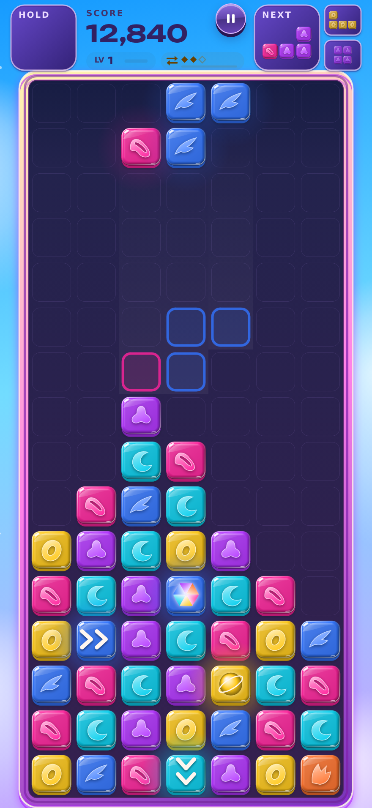
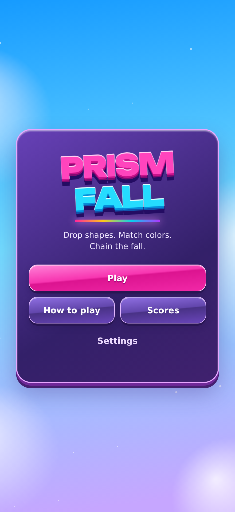

# Glossy arcade artwork

The visual target is the latest bright arcade reference: saturated jewel pieces, strong polished highlights, raised emblems, a luminous board rim and playful depth. Original ribbon, halo, crescent, wing, bloom and flare emblems replace the reference's pieces. Line specials use chevrons, area specials use an orbital sphere, and the prism uses a six-sector spectral core. The existing 7×16 board and action animations are preserved.

The gameplay image uses a seeded board to show the ordinary pieces, line blaster, bomb and prism together. This fixture is not included in normal gameplay.

## Verified

- Existing engine test suite passes; game rules are unchanged.
- Chromium rendering reviewed at 440 × 956, 390 × 844 and 956 × 440 CSS pixels.
- Pause, settings, color symbols, resume and offline reload checked with no page errors.
- Shared artwork and core modules load through the service worker while offline.
- Icons and all six iOS launch-screen sizes regenerated with the shared renderer.
- Single-file artifact build succeeds.

Physical iPhone Safari testing remains outstanding. Artwork is cached Canvas rendering; the game remains dependency-free at runtime and works offline.
